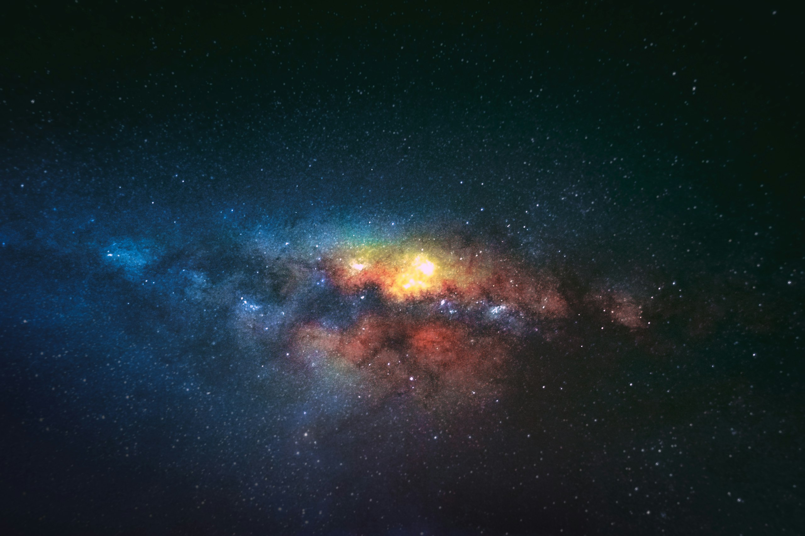

<div align="center">

# 🌌 Genesis

### A real-time, GPU-accelerated procedural planet studio for the web.

Sculpt continents, ignite volcanoes and wrap worlds in living atmospheres — then render them in cinematic 4K, all from your browser. No installs, no plugins, no bake times.

[**Launch the Studio →**](https://genesis-app-orpin.vercel.app/studio) &nbsp;·&nbsp; [Live Demo](https://genesis-app-orpin.vercel.app) &nbsp;·&nbsp; [Report a Bug](https://github.com/shahriar-ahmed-seam/genesis/issues)




</div>

---

## ✨ Overview

**Genesis** turns a single random seed into an entire, explorable world. Procedural fractal noise displaces a sphere into terrain, custom GLSL shaders paint oceans, land and snow, and a cinematic post-processing stack composites it all into a film-grade frame — at 60 fps, in real time.

It ships with a polished marketing site and a full-featured **Studio** where every parameter — terrain, biomes, palette, vegetation, lighting and render — is yours to direct live.

## 🚀 Features

- **🌍 Seven world archetypes** — Terra (Earth-like), Colossus (gas giant), Glacius (ice), Ares (desert/Mars), Selene (cratered moon), Ignis (volcanic) and Neonix (cyberpunk ecumenopolis), each hand-tuned.
- **⛰️ Procedural terrain engine** — multi-octave fractal Brownian motion + cellular (Voronoi) noise for craters, all seeded and reproducible.
- **🎨 Custom GLSL shaders** — biome-aware planet surfaces, swirling gas-giant storms with domain warping, animated cloud layers, banded planetary rings and a fresnel atmosphere shell.
- **🎬 Cinematic rendering** — HDR bloom, film grain and vignette via `@react-three/postprocessing`.
- **🕹️ Real-time Studio** — a bespoke glassmorphism control panel (no dev GUIs) driven by a single Zustand store, with collapsible sections for terrain, biome levels, palette, vegetation, lighting and render.
- **📸 One-click export** — save the current frame as a PNG, or copy a shareable link.
- **🪐 Deep-link presets** — `/studio?type=lava` opens straight into a world.
- **📱 Responsive & accessible** — works on desktop and mobile, with reduced-motion-friendly interactions.
- **🖼️ Cinematic imagery pipeline** — a build-time script pulls curated 4K photography from Unsplash (key never reaches the browser).

## 🛠️ Tech Stack

| Layer            | Technology                                              |
| ---------------- | ------------------------------------------------------- |
| Framework        | [Next.js 16](https://nextjs.org/) (App Router, Turbopack) |
| UI runtime       | React 19                                                |
| 3D engine        | [Three.js](https://threejs.org/) + [React Three Fiber](https://docs.pmnd.rs/react-three-fiber) |
| Shaders          | Hand-written GLSL                                       |
| Post-processing  | `@react-three/postprocessing`                           |
| State            | [Zustand](https://github.com/pmndrs/zustand)            |
| Procedural noise | `simplex-noise`                                         |
| Animation        | Framer Motion                                           |
| Styling          | Tailwind CSS v4                                         |
| Language         | TypeScript                                              |

## 🏁 Getting Started

```bash
# 1. Clone
git clone https://github.com/shahriar-ahmed-seam/genesis.git
cd genesis

# 2. Install
npm install

# 3. (Optional) configure imagery
cp .env.example .env.local      # add your Unsplash Access Key

# 4. (Optional) fetch cinematic imagery
npm run fetch:images

# 5. Develop
npm run dev                     # http://localhost:3000
```

> 💡 The repo ships with imagery already in `public/images`, so steps 3–4 are optional. Without an Unsplash key the app falls back gracefully.

### Scripts

| Command               | Description                                  |
| --------------------- | -------------------------------------------- |
| `npm run dev`         | Start the dev server (Turbopack)             |
| `npm run build`       | Production build                             |
| `npm run start`       | Serve the production build                   |
| `npm run lint`        | Lint with ESLint                             |
| `npm run fetch:images`| Pull curated imagery from Unsplash           |

## 🗂️ Project Structure

```
genesis/
├── app/                  # Next.js App Router
│   ├── page.tsx          # Cinematic marketing landing page
│   ├── studio/           # The interactive 3D studio (page + client)
│   ├── layout.tsx        # Root layout, fonts, SEO metadata
│   └── globals.css       # Design system & Tailwind layer
├── components/
│   ├── planet/           # The 3D scene — Scene, Planet, Atmosphere,
│   │                     #   CloudLayer, PlanetRings, Trees
│   ├── site/             # Landing-page sections (Hero, Worlds, Gallery…)
│   └── studio/           # Studio UI (ControlPanel, Toolbar, controls)
├── shaders/              # GLSL: planet + gas-giant shaders
├── hooks/                # usePlanetTerrain (procedural geometry)
├── lib/                  # Zustand store + image manifest helpers
├── config/               # Planet archetype definitions
├── scripts/              # Build-time Unsplash image pipeline
└── docs/                 # Architecture & release notes
```

See [`docs/ARCHITECTURE.md`](docs/ARCHITECTURE.md) for a deeper dive into the rendering pipeline.

## ☁️ Deployment

Genesis is a static-friendly Next.js app and deploys to [Vercel](https://vercel.com) with zero config:

```bash
vercel --prod
```

Or connect the GitHub repo in the Vercel dashboard for automatic deploys on every push.

## 🖼️ Image Credits

Cinematic photography courtesy of [Unsplash](https://unsplash.com) — see the in-app footer for individual photographer attribution (NASA, Lightscape, Jeremy Thomas, Nicolas Thomas, Javier Miranda, Ezi and more).

## 📄 License

[MIT](LICENSE) © Shahriar Ahmed

<div align="center">
<sub>Built with Next.js, Three.js & a love for the cosmos.</sub>
</div>
